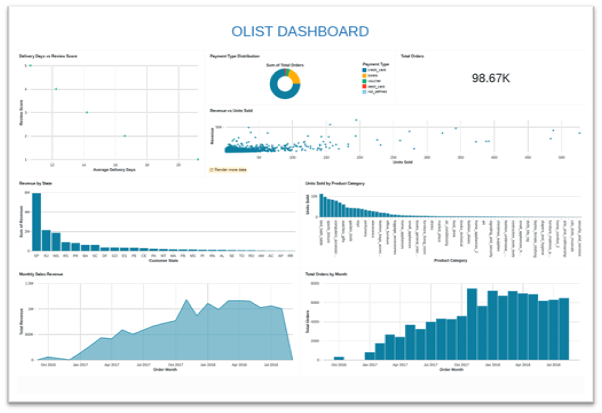
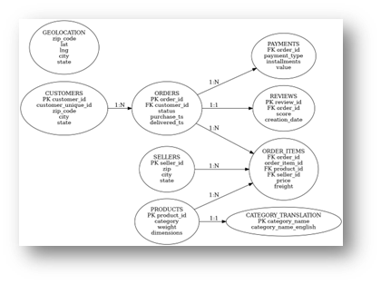
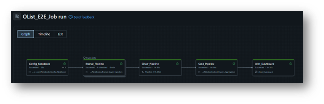
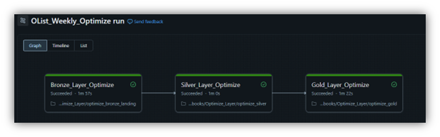

# Olist E-Commerce Lakehouse Analytics Platform

A production-grade Databricks Lakehouse implementation using Auto Loader, Delta Live Tables, Unity Catalog, and Lakeflow Jobs to deliver scalable analytics on Brazilian e-commerce data.

## DASHBOARD OVERVIEW: 

## Architecture Overview

This project follows the Medallion Architecture (Bronze, Silver, Gold) implemented on Databricks using:
- Delta Lake
- Unity Catalog
- Auto Loader
- Delta Live Tables (DLT)
- Lakeflow Jobs
- Databricks SQL Warehouse

## Dataset

Source: Brazilian Olist E-Commerce Dataset  
https://www.kaggle.com/datasets/olistbr/brazilian-ecommerce

Total datasets ingested: 9
- customers
- sellers
- orders
- order_items
- payments
- reviews
- products
- product_category_translation
- geolocation

## ER DIAGRAM: 

## Repository Structure

configs/
- Metadata-driven configuration for Silver layer

ETL_Olist/
- transformations/
  - PROD.py (DLT Silver pipeline)
- utilities/
- archive_transformations/

Jobs/
- ### Lakeflow ingestion jobs
  
- ### Maintenance & optimization jobs

Notebooks/
- Bronze ingestion notebooks
- Gold aggregation notebooks

## Bronze Layer – Raw Ingestion

- Incremental ingestion using Auto Loader
- Schema-relaxed, append-only tables
- ETL audit column (etl_date)
- Checkpointing for exactly-once processing
- Stored as Delta tables in Unity Catalog

Bronze acts as the immutable system of record.

## Silver Layer – Data Quality & Conformance

Implemented using Delta Live Tables (DLT):
- Explicit schema enforcement
- Metadata-driven transformations
- DLT Expectations for data quality
- Quarantine tables for invalid records
- Deduplication using business keys

### Slowly Changing Dimensions
- SCD Type 2: Customers, Sellers, Products, Geolocation
- No SCD for fact tables

## Gold Layer – Analytics

Business-aggregated, BI-ready tables:
- daily_sales
- monthly_sales
- seller_performance
- customer_ltv
- state_wise_revenue
- payment_method_stats
- category_performance
- top_products
- delivery_vs_reviews

Built using idempotent batch SQL and served via Databricks SQL Warehouse.

## Example Queries
SELECT * FROM olist_db.gold.daily_sales WHERE order_date > '2025-01-01';

## Optimization & Maintenance

A dedicated Lakeflow job handles platform maintenance:

Bronze:
- Auto Optimize enabled
- VACUUM with 7-day retention

Landing:
- VACUUM on intermediate DLT tables

Silver & Gold:
- Scheduled OPTIMIZE
- Z-ORDER on high-cardinality and frequently filtered columns
- Query-pattern-driven optimization strategy

- ## Technologies Used

- Databricks
- Delta Lake
- Delta Live Tables (DLT)
- Lakeflow Jobs
- Auto Loader
- Unity Catalog
- Spark (PySpark & SQL)
- Databricks SQL Warehouse

## Author: Sahasrak Ray

